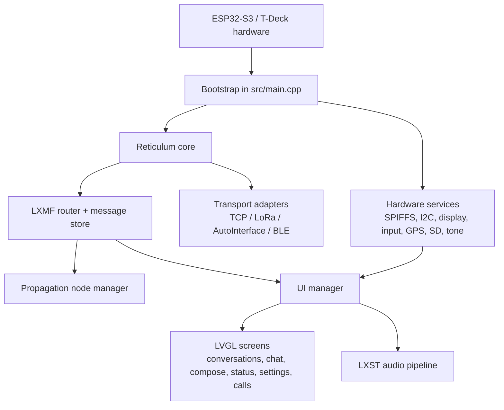

# Pyxis Architecture

## Overview

Pyxis is embedded firmware for the LilyGO T-Deck Plus built with PlatformIO, Arduino, and ESP32-S3 libraries. It combines:

- T-Deck hardware support
- Reticulum transport and routing
- LXMF messaging
- LXST voice calling
- An LVGL-based device UI

At a high level, `src/main.cpp` assembles a set of transport adapters, storage layers, and UI screens around a single Reticulum identity. The device can carry Reticulum traffic over TCP, LoRa, WiFi peer discovery, and BLE, then expose messaging and voice features through the T-Deck screen, keyboard, touch input, and audio hardware.

## Build and platform model

The project is configured in `platformio.ini` for ESP32-S3-based T-Deck hardware. There are two main build environments:

- `env:tdeck`: default build using NimBLE to reduce RAM use
- `env:tdeck-bluedroid`: fallback BLE build using Bluedroid

Important build-time characteristics:

- Arduino framework on `espressif32`
- PSRAM enabled for LVGL buffers and large runtime objects
- SPIFFS-backed persistence via a custom filesystem wrapper
- Optional instrumentation for boot profiling and memory monitoring
- OTA update support

## Top-level runtime architecture

## Repository structure

The main architectural areas are:

- `src/main.cpp`: application composition root, startup, and main event loop
- `src/TCPClientInterface.*`: Reticulum-compatible TCP client transport
- `lib/sx1262_interface`: LoRa transport implementation for the T-Deck radio
- `lib/auto_interface`: IPv6 multicast peer discovery and data transport
- `lib/ble_interface`: BLE mesh-style Reticulum transport
- `lib/tdeck_ui`: T-Deck hardware drivers, LVGL bootstrap, and application UI
- `lib/lxst_audio`: microphone capture, speaker playback, and Codec2 voice pipeline
- `lib/universal_filesystem`: abstraction that mounts platform storage for Reticulum
- `lib/tone`: simple notification audio support
- `tests/interop`: Python interoperability tests, mainly for LXST wire/audio behavior
- `deps/microReticulum`: modified Reticulum implementation used by the firmware

## Composition root: `src/main.cpp`

`src/main.cpp` owns most long-lived objects as globals:

- Reticulum core objects:
  - `Reticulum* reticulum`
  - `Identity* identity`
  - `LXMRouter* router`
  - `MessageStore* message_store`
  - `PropagationNodeManager* propagation_manager`
- UI:
  - `UI::LXMF::UIManager* ui_manager`
- Transport implementations and wrappers:
  - `TCPClientInterface* tcp_interface_impl`
  - `SX1262Interface* lora_interface_impl`
  - `AutoInterface* auto_interface_impl`
  - `BLEInterface* ble_interface_impl`
  - paired `RNS::Interface*` wrappers for registration with Reticulum
- Device/application state:
  - persisted `AppSettings`
  - announce/sync timers
  - WiFi reconnect flags
  - screen and keyboard backlight timeout state
  - GPS state

This file is the orchestrator rather than a thin entry point. Most subsystems are initialized here and then serviced from the main loop.

## Startup sequence

Boot is intentionally staged to get visible feedback on-screen early and to avoid hardware contention.

### 1. Early power and splash

`setup()` first:

- starts serial logging
- powers the peripheral rail
- initializes the display hardware early
- shows a splash before slower startup work begins

This reduces perceived boot time and avoids display-reset timing issues.

### 2. Core hardware services

`setup_hardware()`:

- mounts SPIFFS through `UniversalFileSystem`
- registers the filesystem with Reticulum OS utilities
- initializes I2C for keyboard and touch peripherals

This establishes the persistence and control buses required by later layers.

### 3. Tone and settings

Before networking is configured, boot loads:

- notification tone support
- persisted `AppSettings` from ESP32 `Preferences`/NVS

Settings include WiFi credentials, TCP endpoint, enabled transports, LoRa radio parameters, display behavior, propagation settings, announce intervals, and GPS time-sync preferences.

### 4. GPS and time synchronization

GPS initialization happens before WiFi. The firmware:

- probes supported GPS modules
- attempts time sync from GPS first
- derives a timezone from longitude when location is available
- falls back to NTP after WiFi comes up if GPS sync fails

Time is also bridged into Reticulum's `Utilities::OS::time()` via an uptime-based offset.

### 5. WiFi, OTA, and log broadcasting

If WiFi credentials exist, `setup_wifi()`:

- connects in station mode
- optionally completes time sync via NTP
- enables ArduinoOTA for wireless firmware updates
- configures multicast UDP log broadcasting

OTA temporarily suspends BLE and TCP to reduce radio contention during update transfer.

### 6. Shared SPI coordination

The T-Deck display, SD card, and LoRa radio share SPI resources. `setup()` creates a shared mutex and passes it into:

- SD card access
- display driver
- SX1262 LoRa interface

This is a key hardware constraint in the system design.

### 7. LVGL and UI task bootstrap

`setup_lvgl_and_ui()`:

- initializes LVGL
- aligns the initial screen background with the splash
- starts LVGL on a dedicated FreeRTOS task
- optionally registers the LVGL task with memory instrumentation

The UI is therefore not rendered exclusively from the Arduino loop task.

### 8. Reticulum core and transport adapters

`setup_reticulum()`:

- creates the `Reticulum` instance
- loads or generates the node identity from NVS
- creates and starts enabled transport adapters
- registers each started interface with Reticulum `Transport`

Supported interfaces are described below.

### 9. LXMF services

`setup_lxmf()`:

- creates `MessageStore` rooted at `/lxmf`
- creates `LXMRouter`
- creates and registers `PropagationNodeManager`
- applies propagation-related settings
- sets the display name used in announces
- performs an initial announce when TCP is online

This is the messaging service layer of the device.

### 10. UI manager binding

`setup_ui_manager()` creates `UIManager`, then wires it to:

- Reticulum and LXMF services
- propagation manager
- LoRa interface for signal metrics
- BLE interface for peer counts
- GPS for status displays
- settings callbacks for brightness, WiFi reconnect, and runtime config changes

Delivery callbacks are also registered so network events update both persistence and UI state.

## Transport architecture

Pyxis uses Reticulum's interface model. Each transport implementation derives from `RNS::InterfaceImpl`, then gets wrapped by `RNS::Interface` and registered with `Transport`.

### TCP client transport

Defined in `src/TCPClientInterface.*`.

Responsibilities:

- connect to a Python RNS TCP server
- use HDLC framing for compatibility
- reconnect automatically
- apply TCP keepalive and stale-connection handling

This is the primary WAN or infrastructure-backed Reticulum path when WiFi is available.

### LoRa transport

Defined in `lib/sx1262_interface`.

Responsibilities:

- control the SX1262 radio through RadioLib
- use T-Deck-specific radio pins and shared SPI
- expose link quality values such as RSSI and SNR
- apply LoRa settings from persisted app configuration

This is the local long-range path and is designed to be air-compatible with RNode-style settings.

### AutoInterface

Defined in `lib/auto_interface`.

Responsibilities:

- discover peers over IPv6 multicast
- maintain a live peer list
- handle reverse peering
- deduplicate packets
- detect carrier/echo state changes

This is the zero-config local network Reticulum path when WiFi is connected.

### BLE interface

Defined in `lib/ble_interface`.

Responsibilities:

- run a BLE Reticulum protocol implementation
- support central, peripheral, or dual roles
- manage discovery, handshake, MTU changes, and keepalives
- fragment and reassemble packets for BLE transport
- optionally run on its own FreeRTOS task

The default build uses NimBLE to reduce internal RAM pressure. The BLE implementation is large enough that the firmware explicitly allocates it in PSRAM.

## Messaging and propagation architecture

LXMF functionality is built around three main objects:

- `Identity`: persistent node identity
- `LXMRouter`: delivery destination, announce, inbound/outbound queues, sync
- `MessageStore`: on-device message persistence under `/lxmf`

`PropagationNodeManager` listens for network announces and tracks propagation nodes. The router can be configured to:

- auto-select a propagation node
- use a manually selected node
- fall back to propagation when direct delivery fails
- force propagation-only delivery

The main loop periodically:

- processes router inbound/outbound/sync queues
- announces the local destination
- requests messages from the selected propagation node

## UI architecture

The UI lives under `lib/tdeck_ui` and has three layers.

### 1. Hardware access layer

`lib/tdeck_ui/Hardware/TDeck` contains device-specific wrappers for:

- display
- keyboard
- touch
- trackball
- SD access and SD logging
- board pin configuration

This isolates most T-Deck hardware knowledge from application logic.

### 2. LVGL bootstrap layer

`lib/tdeck_ui/UI/LVGL` contains:

- LVGL initialization
- task startup
- locking helpers for cross-task UI access

Because LVGL runs in its own task, application code uses an LVGL lock around UI mutations.

### 3. LXMF application screens

`lib/tdeck_ui/UI/LXMF` contains screen objects for:

- conversation list
- chat
- compose
- announce list
- status
- QR sharing
- settings
- propagation nodes
- call UI

`UIManager` is the coordinator for these screens. It is responsible for:

- creating all screens
- wiring screen callbacks
- switching active screens
- forwarding LXMF delivery events into the UI
- refreshing status indicators
- bridging settings changes back into system services
- managing LXST call lifecycle

The UI layer depends on Reticulum and LXMF services; the reverse dependency is minimal except for event callbacks registered from `main.cpp`.

## Voice call architecture

Voice support is split between UI-level call control and a lower-level audio pipeline.

### Call control

`UIManager` owns the LXST call state machine. It creates an LXST destination, registers announce handlers, reacts to incoming links, and coordinates:

- outgoing call setup
- incoming call answer/hangup
- mute state
- call screen state
- audio packet TX/RX pumping

### Audio pipeline

`lib/lxst_audio` provides `LXSTAudio`, which coordinates:

- ES7210 microphone setup
- I2S capture
- I2S playback
- Codec2 encoder/decoder lifecycle
- ring buffers for encoded and playback data
- coexistence with the tone generator

The design supports capture-only, playback-only, and full-duplex operation. The main loop calls `ui_manager->pump_call_tx()` immediately after `reticulum->loop()` to minimize voice transmit latency.

## Storage architecture

There are two persistent storage mechanisms.

### NVS / Preferences

ESP32 `Preferences` is used for small, critical configuration and identity data:

- app settings
- Reticulum private identity key
- propagation node selection
- crash breadcrumbs and diagnostic data

This is used for data that must survive reflashing and power cycles.

### SPIFFS via `UniversalFileSystem`

`UniversalFileSystem` adapts platform storage to Reticulum's filesystem abstraction. It is used for larger structured data such as:

- LXMF message store contents
- Reticulum persistence files
- cached transport/identity metadata

The code also supports SD card access separately for logging.

## Event loop model

After startup, `loop()` acts as a cooperative scheduler. Its major phases are:

1. feed the watchdog
2. service OTA
3. handle serial commands for flasher tooling
4. run LVGL task handling hooks
5. process deferred WiFi reconnect requests
6. run `reticulum->loop()`
7. pump voice TX immediately after Reticulum
8. persist Reticulum and identity data when dirty
9. run transport-specific loops for TCP, LoRa, and BLE
10. process LXMF router queues
11. update UI manager
12. poll memory instrumentation
13. run periodic announce and propagation-sync tasks
14. react to transport reconnection and connection-state changes

This is not a message-bus architecture or RTOS-heavy actor model. It is a mostly centralized event loop with a few dedicated tasks for LVGL and, optionally, BLE.

## Concurrency model

The firmware uses a hybrid concurrency approach:

- Arduino `loop()` remains the main orchestrator
- LVGL runs in its own FreeRTOS task
- BLE may run in its own FreeRTOS task
- shared hardware resources, especially SPI, are protected with a mutex
- UI mutations use an LVGL lock
- some work is deferred from UI callbacks into the main loop to avoid blocking LVGL

Examples of deferred work include WiFi reconnect requests initiated from settings UI callbacks.

## Diagnostics and operational concerns

The codebase contains several operational safeguards:

- boot profiling markers for slow startup phases
- memory instrumentation hooks
- watchdog resets during long operations
- UDP multicast log broadcasting for remote observation
- reset-reason logging
- crash breadcrumbs for LXST diagnostics
- SD logging when a card is present

These features are important because the system runs on constrained hardware with multiple competing radios, display workloads, and audio workloads.

## Test coverage shape

The `tests/interop` suite is Python-based and focused on interoperability rather than unit testing the firmware directly. The visible tests emphasize LXST audio behavior:

- wire format compatibility
- codec round-trips
- full pipeline simulation

This suggests the highest-risk integration area is cross-implementation voice compatibility with other LXST/Reticulum tools.

## Key architectural characteristics

The most important things to understand about Pyxis are:

- `src/main.cpp` is the composition root and operational scheduler
- Reticulum is the networking core, with Pyxis-specific adapters around it
- LXMF messaging and LXST calling are service layers on top of Reticulum
- the UI is a first-class subsystem with its own task and locking model
- hardware constraints, especially shared SPI and limited RAM, strongly shape design choices
- configuration is intended to be user-editable at runtime through the settings UI

## Typical end-to-end flow

For a received message:

1. a transport adapter receives bytes from TCP, LoRa, WiFi peer discovery, or BLE
2. Reticulum processes the packet
3. LXMF router identifies and persists the message
4. delivery callbacks notify application code
5. `UIManager` updates the relevant screen state
6. optional tone notification plays

For a voice call:

1. LXST announce or link activity is observed by `UIManager`
2. call state transitions are driven from the UI manager
3. microphone audio is captured and encoded by `LXSTAudio`
4. encoded packets are transmitted over Reticulum links
5. received audio packets are decoded and played back through the speaker path

## Architectural tradeoffs

The current design favors:

- direct control from one central composition file
- predictable cooperative scheduling
- low-overhead embedded abstractions
- interoperability with existing Reticulum/LXMF/LXST implementations

The cost is that:

- `src/main.cpp` carries a large amount of orchestration responsibility
- runtime state is fairly global
- subsystem coupling is managed procedurally rather than through narrower service boundaries

That tradeoff is common in embedded firmware, especially when startup order, hardware ownership, and memory placement matter as much as clean layering.
